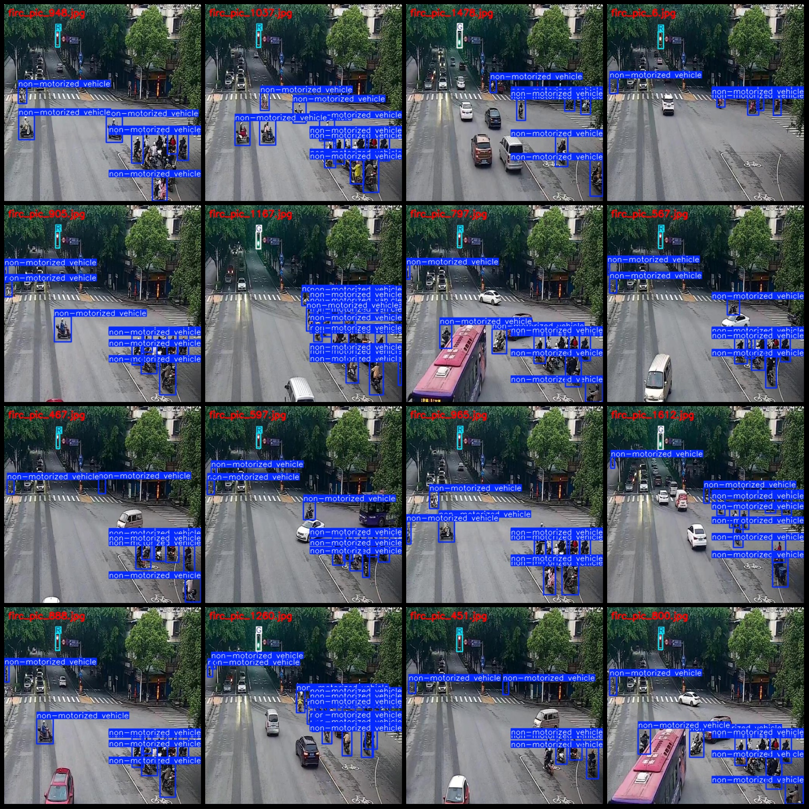
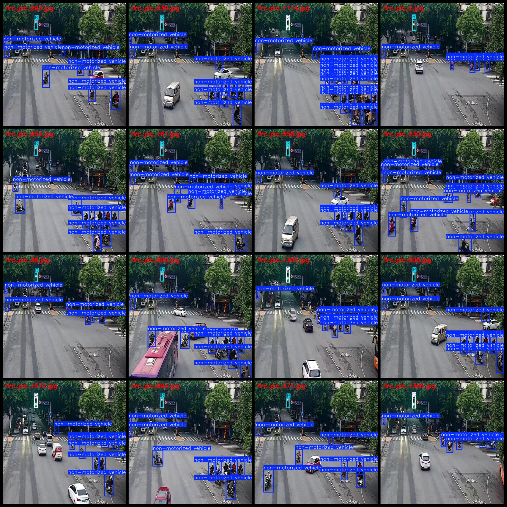

# Non-motor vehicle and motorcycle violation detection dataset in VOC+YOLO format with 1754 images in three categories

Dataset format: Pascal VOC format+YOLO format(without split path's txtfile, only contain jpgimage and corresponding VOC format xmlfile and yolo format txtfile)
number of images: 1754  
annotation count: 1754  
annotation count: 1754  
annotationnumber of classes: 3  
Annotation class names ("G", "R", "non-motorized vehicle"): ["G", "R", "non-motorized vehicle"]
boxes per class:   
Green light box count = 707  
Red light box count = 1047  
Non-motorized vehicle (non-motorized vehicles) box count = 16646
total boxes: 18400  
images per class:   
Green light images: 707  
Red light images: 1047  
Non-motorized vehicle (non-motorized vehicles) images: 1754
Image resolution: 512x512
Use the annotation tool: labelImg
Annotation rules: draw a rectangle box around the class
Important notes: dataset does not have separate training, validation, and test sets; you will need to partition them yourself.
Special statement: this dataset does not guarantee the accuracy of the trained model or weight file.
Preview of the image:
Annotation example:
## Images

Here is a pay link on Stripe ( https://buy.stripe.com/3cs8yP7sY87d0vu9AB ). Please contact me lonlonago@foxmail.com after funding $89, and I will send you a complete data files , thank you!

